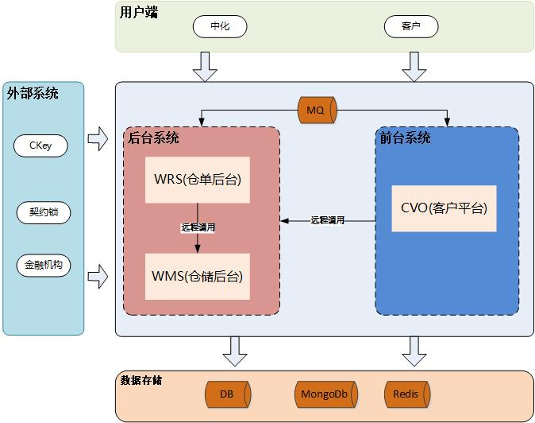
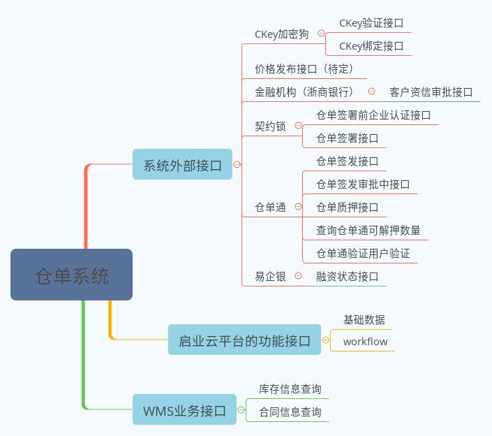

# 目录

[TOC]

# 整体架构

# 外部接口依赖

# 工程结构：

## 模块依赖

--wrs 
-------|------wrs-web              #对访问控制进行转发各类基本参数校验或者不复用的业务简单处理等,提供restful口 
-------|------wrs-service         #具体业务处理模块，可以调用manager层，也可以直接调用dao层 
-------|------wrs-manager     #对 Service 层通用能力的下沉，如缓存方案、中间件通用处理,与 DAO 层交互，													对多个 DAO 的组合复用  
-------|------wrs-dao               #数据持久化层,包含redis,db或者其他的数据持久化实现 
-------|------wrs-extendapi    #外部业务接口 外部的RPC 开放接口，基础平台，契约锁，浙商银行，授权服务其它													公司的 HTTP 接口 
-------|------wrs-common      #通用工具类模块       
-------|------wrs-bank             #封装对接浙商银行接口,单独部署 

## 调用时序：

wrs-web  
   |
   ----> wrs-service 
   |---------| 
   |---------|-----------------------------------------> wrs-extendapi  
   |---------|-------> wrs-manager &ensp;&ensp; &ensp;&ensp; &ensp; &ensp;&ensp;&ensp;&ensp;&ensp;&ensp;&ensp;&ensp;| 
   |---------|---------------| &ensp;&ensp;&ensp;&ensp;&ensp; &ensp; &ensp; &ensp; &ensp; &ensp; &ensp;&ensp;&ensp;&ensp;&ensp;&ensp;&ensp;	| 
   |---------|---------------|---------------->wrs-dao&ensp;&ensp;&ensp;&ensp;| 
   |---------|---------------|---------------------|&ensp;&ensp;&ensp;&ensp;&ensp;&ensp;&ensp;&ensp; | 
   |---------|---------------|---------------------|-------------|------->wrs-common   
                     

##  配置文件

 -
 	-

 

#  控制台

-  swagger-ui访问地址: http://127.0.0.1:8080/wrs/swagger-ui.html
- druid控制台访问url:http://127.0.0.1:8080/wrs/druid/login.html

***
#  TODO

- [ ] 字段级别的权限控制
- [ ] 系统中依赖外部的接口较多，需要保证分布式事务一致性，保证本地事务提交成功后调用外部的接口.外部接口有回滚接口的异常情况下调用外部回滚接口
- [ ] 管理端到客户端的消息同步，需要保证本地事务提交成功后做消息同步发送，rabbitMQ不支持分布式事务，需要本地添加日志表。消费端支持幂等,管理端定期做同步数据补偿
- [ ] 管理端基于平台的流程定制流程开发中有hard code的平台的配置信息(节点。客户端映射的角色组ID，用户名,节点Key)大部分配置在SystemConstants
- [ ] 浙商银行的数字认证校验逻辑暂mark，需要打开做验证
- [ ] 浙商银行的接口无异常码，异常处理较不友好，需要几何提示文字做业务兼容(客户端超时,但是服务端已经处理,再次请求时候根据异常信息做业务兼容)

